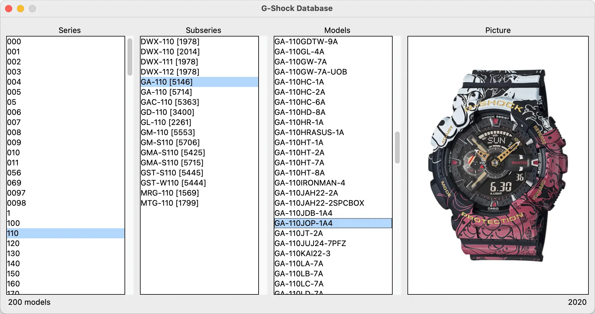

# G-Shock Database

## 🔖 Table of contents

<details>
        <summary>
            CLICK TO ENLARGE 😇
        </summary>
        📄 <a href="#description">Description</a>
        <br>
        🎓 <a href="#objectives">Objectives</a>
        <br>
        🔨 <a href="#tech-stack">Tech stack</a>
        <br>
        📂 <a href="#files-description">Files description</a>
        <br>
        💻 <a href="#installation_and_how_to_use">Installation and how to use</a>
        <br>
        🔧 <a href="#whats-next">What's next?</a>
        <br>
        ♥️ <a href="#thanks">Thanks</a>
        <br>
        👷 <a href="#authors">Authors</a>
</details>

## 📄 <span id="description">Description</span>

This project is an application designed to explore the world of Casio G-Shock watches. As a fan of the brand, I wanted to create a tool that gathers data about these watches and makes it easily accessible. The development started with a web scraper that retrieves detailed information from the [ShockBase](https://shockbase.org) website, one of the most comprehensive resources for G-Shock enthusiasts. The collected data is then presented through a graphical user interface that allows users to browse, search, filter information, and view photos of the products.

This project was inspired by my passion for G-Shock watches and serves as a tool for learning and exploration. All credit for the database content belongs to [ShockBase](https://shockbase.org), and the app is not intended for public distribution to avoid competing with their excellent work.

## 🎓 <span id="objectives">Objectives</span>

- Enhance my skills in web scraping using Python.
- Develop a graphical user interface (GUI) to present and interact with the collected data.
- Gain hands-on experience in data processing and structuring scraped information.
- Explore user interface design principles for an intuitive browsing experience.
- Integrate web scraping and GUI development into a cohesive and functional application.

## 🔨 <span id="tech-stack">Tech stack</span>

<p align="left">
    
    
    
    
    
</p>

## 📂 <span id="files-description">File description</span>

| **FILE**               | **DESCRIPTION**                                       |
| :--------------------: | ----------------------------------------------------- |
| `assets`               | Contains the resources required for the repository.   |
| `shockbase_scraper.py` | Script to scrape data from the ShockBase website.     |
| `gshock_database.py`   | Main script to launch the application.                |
| `shockbase.csv`        | Local database generated from the scraping process.   |
| `requirements.txt`     | List of dependencies required for the script.         |
| `.gitignore`           | Specifies files and folders to be ignored by Git.     |
| `README.md`            | The README file you are currently reading 😉.         |

## 💻 <span id="installation_and_how_to_use">Installation and how to use</span>

**Installation:**

1. Clone this repository:
    - Open your preferred Terminal.
    - Navigate to the directory where you want to clone the repository.
    - Run the following command:

```
git clone https://github.com/fchavonet/python-gshock_database.git
```

2. Open the repository you've just cloned.

4. Create a virtual environment:

```
python3 -m venv venv
```

5. Activate the virtual environment:

```
source venv/bin/activate
```

6. Install dependencies:

```
pip install -r requirements.txt
```

**How to use:**

1. Run the `shockbase_scraper.py` script to scrape the data:

```
python shockbase_scraper.py
```

2. Launch the application:

```
python gshock_database.py
```

<p align="center">
    
</p>

## 🔧 <span id="whats-next">What's next?</span>

- Add a search engine.
- Implement a sorting menu to organize results by release date or other criteria.
- Add an update button in the GUI to trigger the scraping process in the background, keeping the database up-to-date.

## ♥️ <span id="thanks">Thanks</span>

- A big thank you to the [ShockBase](https://shockbase.org) website for their incredible work cataloging G-Shock watches.
- Thank you to my friends for their feedback and support during the development of this little project.

## 👷 <span id="authors">Authors</span>

**Fabien CHAVONET**
- Github: [@fchavonet](https://github.com/fchavonet)
