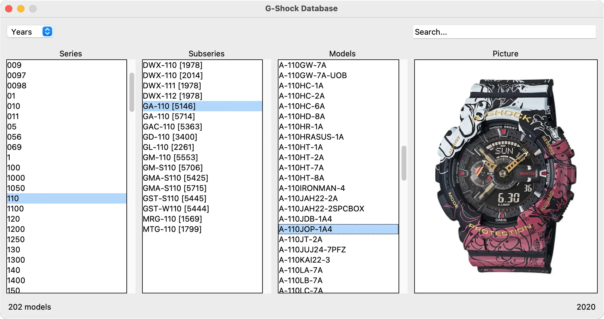

# G-Shock Database

## Description

This project is an application designed to explore the world of Casio G-Shock watches. As a fan of the brand, I wanted to create a tool that gathers data about these watches and makes it easily accessible. The development started with a web scraper that retrieves detailed information from the [ShockBase](https://shockbase.org) website, one of the most comprehensive resources for G-Shock enthusiasts. The collected data is then presented through a graphical user interface that allows users to browse, search, filter information, and view photos of the products.

This project was inspired by my passion for G-Shock watches and serves as a tool for learning and exploration. All credit for the database content belongs to [ShockBase](https://shockbase.org), and the app is not intended for public distribution to avoid competing with their excellent work.

## Objectives

- Enhance my skills in web scraping using Python.
- Develop a graphical user interface (GUI) to present and interact with the collected data.
- Gain hands-on experience in data processing and structuring scraped information.
- Explore user interface design principles for an intuitive browsing experience.
- Integrate web scraping and GUI development into a cohesive and functional application.

## Tech Stack


## File Description

| **FILE**               | **DESCRIPTION**                                       |
| :--------------------: | ----------------------------------------------------- |
| `assets`               | Contains the resources required for the repository.   |
| `shockbase_scraper.py` | Script to scrape data from the ShockBase website.     |
| `gshock_database.py`   | Main script to launch the application.                |
| `shockbase.csv`        | Local database generated from the scraping process.   |
| `requirements.txt`     | List of dependencies required for the script.         |
| `.gitignore`           | Specifies files and folders to be ignored by Git.     |
| `README.md`            | The README file you are currently reading 😉.         |

## Installation & Usage

### Installation

1. Clone this repository:
    - Open your preferred Terminal.
    - Navigate to the directory where you want to clone the repository.
    - Run the following command:

```
git clone https://github.com/fchavonet/python-gshock_database.git
```

2. Open the cloned repository.

3. Create a virtual environment:

```
python3 -m venv venv
```

4. Activate the virtual environment:

```
source venv/bin/activate
```

> On Windows: `venv\Scripts\activate`.

5. Install dependencies:

```
pip install -r requirements.txt
```

### Usage

1. Run the `shockbase_scraper.py` script to scrape the data:

```
python shockbase_scraper.py
```

2. Launch the application:

```
python gshock_database.py
```

<p align="center">
    <picture>
        <source media="(prefers-color-scheme: dark)" srcset="./assets/images/screenshot-dark.webp">
        <source media="(prefers-color-scheme: light)" srcset="./assets/images/screenshot-light.webp">
        
    </picture>
</p>

## What's Next?

- Add an update button to trigger the scraping process in the background, keeping the database up-to-date.
- Clean the code.

## Thanks

- Thank you to the [ShockBase](https://shockbase.org) website for their incredible work cataloging G-Shock watches.
- A big thank you to my friends Pierre and Yoann, always available to test and provide feedback on my projects.

## Author(s)

**Fabien CHAVONET**
- GitHub: [@fchavonet](https://github.com/fchavonet)
